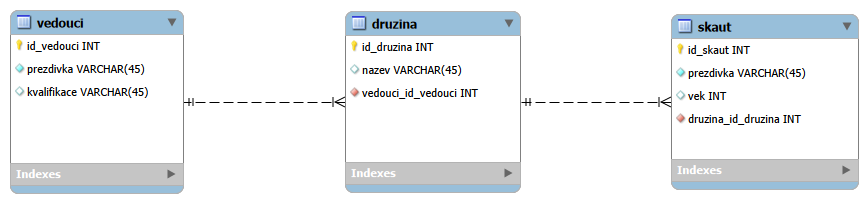

# Skautská databáze

Databáze se 3 entitními a 2 vztahovými typy byla vytvořena v MySQL Workbench.

## Odkaz na GitHub

[github.com/MaK-024/skautska-db](https://github.com/MaK-024/skautska-db)

## Slovní popis

Databáze slouží k evidenci členů fiktivního skautského oddílu. Eviduje vedoucí, družiny a skauty. Každá družina je vedena jedním vedoucím a obsahuje více skautů. Každý skaut je zařazen právě do jedné družiny. Databáze umožňuje přehledně evidovat složení družin a jejich vedení.

## E-R schéma

## Relační model databáze

### Tabulka Vedoucí
| Atribut | Datový typ | Klíč |
|----------|----------|----------|
| id_vedouci | INT | PK |
| prezdivka | VARCHAR(45) | |
| kvalifikace | VARCHAR(45) | |

### Tabulka Družina
| Atribut | Datový typ | Klíč |
|----------|----------|----------|
| id_druzina | INT | PK |
| nazev | VARCHAR(45) | |
| vedouci_id_vedouci | INT | FK |

### Tabulka Skaut
| Atribut | Datový typ | Klíč |
|----------|----------|----------|
| id_skaut | INT | PK |
| prezdivka | VARCHAR(45) | |
| vek | INT | |
| druzina_id_druzina | INT | FK |

## Demo data

### Vedoucí

| id_vedouci | prezdivka | kvalifikace |
|------------|------------|------------|
| 1 | Medvěd | Vůdcovská zkouška |
| 2 | Vlk | Čekatelská zkouška |
| 3 | Sokol | Vůdcovská zkouška |

### Družina

| id_druzina | nazev | vedouci_id_vedouci |
|------------|--------|-------------------|
| 1 | Rysi | 1 |
| 2 | Orli | 2 |
| 3 | Vydry | 3 |

### Skaut

| id_skaut | prezdivka | vek | druzina_id_druzina |
|-----------|-----------|-----|-------------------|
| 1 | Zelí | 14 | 1 |
| 2 | Mlíko | 13 | 1 |
| 3 | Pytel | 12 | 1 |
| 4 | Drak | 14 | 1 |
| 5 | Šampónek | 15 | 1 |
| 6 | Čára | 13 | 1 |
| 7 | Havran | 14 | 2 |
| 8 | Rohlík | 12 | 2 |
| 9 | Vont | 15 | 2 |
| 10 | Kárl | 13 | 2 |
| 11 | Egon | 13 | 2 |
| 12 | Pecka | 11 | 2 |
| 13 | Prďola | 14 | 3 |
| 14 | Hrom | 15 | 3 |
| 15 | Jose | 14 | 3 |
| 16 | Skuby | 12 | 3 |
| 17 | Krtek | 12 | 3 |
| 18 | Kýbl | 14 | 3 |

## Závěr

Databáze umožňuje evidenci vedoucích, družin a skautů v rámci skautského oddílu. Návrh obsahuje tři entitní typy a dva vztahové typy. Struktura databáze byla navržena v aplikaci MySQL Workbench a doplněna ukázkovými daty.

## Autor

Martin Kriššák, V2I, 2026

